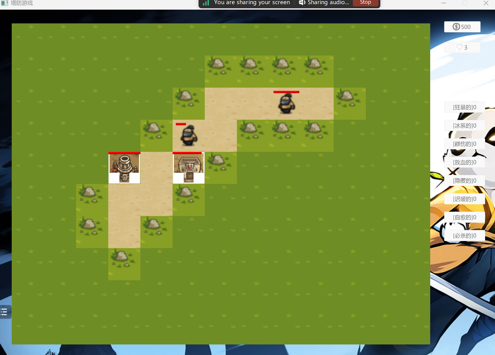

# Tower Defense Game

## Overview

This project is a classic Tower Defense game built using C++ and Qt. Players can strategically place towers to defend against waves of enemies.

## Features

- **Multiple Tower and Enemy Types**: Different towers with unique abilities and upgrades.
- **Various Affixes**: Both your towers and the enemies can have different affixes, giving them special powers.
- **Dynamic Map**: You can edit the map according to your preference and play in it.
- **Custom Settings**: Players can adjust various settings to their preference.

## How to Compile and Run

To compile and run the Tower Defense game, follow these steps:

### Prerequisites

1. **Qt Framework**: Ensure you have the Qt framework installed. You can download it from the [Qt website](https://www.qt.io/download).
2. **MinGW Compiler**: Install MinGW if you haven't already. It's recommended to use the version provided by the Qt installer.
3. **Git**: Make sure Git is installed to clone the repository.

### Steps

1. **Clone the Repository**:
- Open a terminal and run:
  ```bash
    git clone https://github.com/NigelConkeller/tower-defense-game.git
    cd tower-defense-game
  ```

2. **Open the Project in Qt Creator**:
- Launch Qt Creator.
- Open the project by navigating to `File -> Open File or Project...` and selecting the `tower-defense-game.pro` file in the cloned repository.

3. **Configure the Project**:
- Ensure you have a Kit configured for Desktop development using MinGW (or another compatible compiler).
- If you haven't set up a Kit, go to `Tools -> Options -> Kits` and configure one using your installed compiler and Qt version.

4. **Build the Project**:
- In Qt Creator, click the Build button (hammer icon) or go to `Build -> Build Project "tower-defense-game"`.
- If you encounter an error related to resources, ensure that the paths in your `.pro` file are correct and point to the actual resource files.

5. **Run the Game**:
- After successfully building the project, click the Run button (green arrow) or go to `Build -> Run`.
- The game window should open, and you can start playing the Tower Defense game.

### Troubleshooting
- Resource Errors: If you encounter errors related to resource files, ensure the paths in the `.pro` file are correct. For example:
  ```bash
    RESOURCES += \
        resource.qrc
  ```
- Out of Memory Errors: If you encounter out-of-memory errors during compilation, you might need to adjust your system settings or reduce the number of parallel build processes.

- Missing Files: If the game cannot find certain files, ensure all necessary files (e.g., `map.txt`) are in the correct directories.

### Example Project Configuration File (.pro)
- Here’s an example `.pro` file for your project:
  ```pro
    QT += core gui multimedia
    
    greaterThan(QT_MAJOR_VERSION, 4): QT += widgets
    
    CONFIG += c++17
    
    QMAKE_CXXFLAGS += -Wa,-mbig-obj
    
    SOURCES += \
        main.cpp \
        widget.cpp \
        Map.cpp \
        Enemy.cpp \
        Simulation.cpp \
        Defense.cpp
    
    HEADERS += \
        widget.h \
        Map.h \
        Enemy.h \
        Simulation.h \
        Defense.h
    
    FORMS += \
        widget.ui
    
    RESOURCES += \
        resources/resource.qrc
    
    # Default rules for deployment.
    qnx: target.path = /tmp/$${TARGET}/bin
    else: unix:!android: target.path = /opt/$${TARGET}/bin
    !isEmpty(target.path): INSTALLS += target
  ```
By following these steps, you should be able to compile and run the Tower Defense game successfully. If you encounter any issues, feel free to consult the Qt documentation or seek help from the community.

## Effect Display

Here are some images to showcase the effects:




